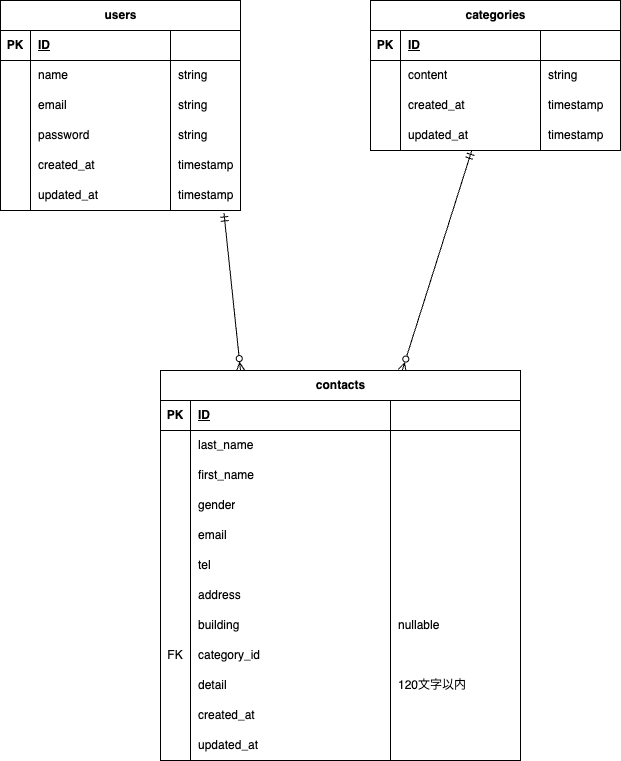

# アプリケーション名 - contact-test

## 環境構築　

### 1. Dockerイメージのビルド
```bash
docker-compose build
```

### 2. Dockerコンテナの起動
```bash
docker-compose up -d
```

### 3. データベースのマイグレーション
```bash
docker-compose exec php php artisan migrate
```

### 4. 初期データの投入（シーディング）
```bash
docker-compose exec php php artisan db:seed

## 使用技術
- PHP　8.1
- Laravel　8.83.8
- MySQL　8.0.26
- Docker / Docker Compose

## データベース設計



## URL
- 開発環境
- http//localhost/
- http//localhost/contacts/confirm
- http//localhost/contacts/thanks
- http//localhost/register
- http//localhost/login
- http//localhost/admin
- http//localhost/admin/search
- http//localhost/admin/reset
- http//localhost/admin/search